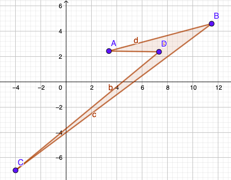
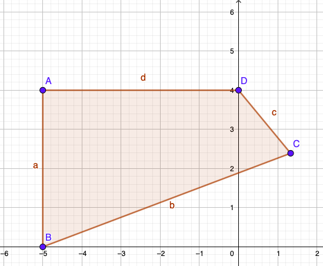

# Geometric calculator

## Table of contents
* [General info](#general-info)
* [Mathematical inserts](#mathematical-inserts)
* [Technologies](#technologies)
* [Examples of program effects](#examples-of-program-effects)
* [Status](#status)

## General info
This program is an example of a geometric calculator. 
The purpose of this program is to calculate the exact area and perimeter of a plane figure with given floating point coordinates (not necessarily integers). 
So, more generally: the result of the program is the exact area and perimeter of the figure at n-'vertex points' (where n = {3, 4}) oriented on the Cartesian coordinate system.

## Mathematical inserts

##### Heron
Heron's formula was used to calculate the area of the triangle.

<a href="https://www.codecogs.com/eqnedit.php?latex=p&space;=&space;\frac{a&plus;b&plus;c}{2}" target="_blank"></a>
   
<a href="https://www.codecogs.com/eqnedit.php?latex=S&space;=&space;\sqrt{p(p-a)(p-b)(p-c)}" target="_blank"></a>


##### Bretschneider
The calculation of the area of the quadrilateral was difficult as it might have floating point coordinates and an undefined orientation on the surface (e.g. the strange figure in Example No. 1 below).
Therefore, the Bretschneider's formula was used in the program.

<a href="https://www.codecogs.com/eqnedit.php?latex=s&space;=&space;\frac{a&plus;b&plus;c&plus;d}{2}" target="_blank"></a>

<a href="https://www.codecogs.com/eqnedit.php?latex=S&space;=&space;\sqrt{(s-a)(s-b)(s-c)(s-d)-abcd&space;\cdot&space;\cos^{2}(\frac{\alpha&space;&plus;&space;\gamma&space;}{2})&space;}" target="_blank"></a>

## Technologies
The program was written in C++ using the 'cmath' library.

## Examples of program effects

#### Ex. 1
```cpp
   // main 'input'
   
    Point a, b, c, d;
    a.setXY(3.38,2.42);
    b.setXY(11.5,4.58);
    c.setXY(-4,-7);
    d.setXY(7.34,2.36);

    Coord mc(a,b,c,d);
    mc.print();
```

```meanwhile
   // output
   ----------------------
   Perimeter: L = 46.4148
   Area: S = 11.4018
   ----------------------
```
#### Ex. 2
```cpp
   // main 'input'
   
    Point a, b, c, d;
    a.setXY(-5,4);
    b.setXY(-5,0);
    c.setXY(1.33,2.39);
    d.setXY(0,4);

    Coord mc(a,b,c,d);
    mc.print();
```

```meanwhile
   // output
   ----------------------
   Perimeter: L = 17.8545
   Area: S = 16.685
   ----------------------
```

## Status
Complete program (as described), with the possibility of updating with new features in the future.
